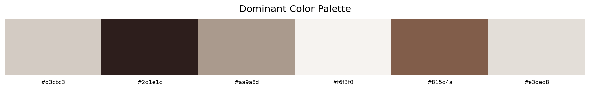

# 🎨 Color Palette Extractor

## What does this do?
To analyse colors in an image, we first need to bring it into Python. 
Since Python can't read web images directly, we use requests to fetch it, 
BytesIO to package it, and PIL to open it properly.

But we can't run a model on a pretty image — we need numbers! So numpy 
converts every pixel into its RGB values, giving us a giant 2D table of 
rows × 3 columns (R, G, B).

Now K-Means runs on this table — grouping all pixels into color families. 
The centre of each family = the most representative color of that group. 
Those centres = our dominant colors!

Finally we plot them as a clean color palette strip — and score how 
harmonious they are using Euclidean distance. Colors close together = 
high harmony score — like hitting the dartboard centre! 🎯

## Tech used:
- Python
- Pillow (PIL) — image processing
- NumPy — pixel manipulation
- Scikit-learn — K-Means clustering
- Matplotlib — color palette visualization
- SciPy — Euclidean distance for harmony scoring

## How to run:
1. Clone this repo
2. Install requirements: `pip install pillow numpy scikit-learn matplotlib scipy requests`
3. Open `color_extractor.py`
4. Replace the image URL with any direct image URL (.jpg/.png)
5. Run!

## Sample Output:

## Coming soon:
- File upload interface (Streamlit)
- Style classification (Minimalist / Moody / Warm / Cool)
- Full Brand Aesthetics Analyzer for Instagram feeds!

## Author
Akshaya Motamarri | Data Science Consultant | Wells Fargo
